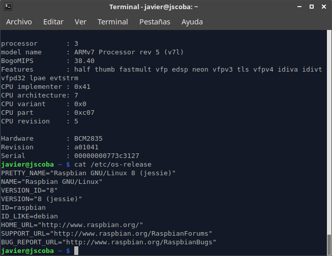

# Ejercicios tema 1 IV - jscoba

## Ejercicio 1 - Consultar en el catálogo de alguna tienda de informática el precio de un ordenador tipo servidor y calcular su coste de amortización a cuatro y siete años. Consultar [este artículo en Infoautónomos sobre el tema](http://infoautonomos.eleconomista.es/consultas-a-la-comunidad/988/).

Suponiendo este servidor [**Dell PowerEdge R330 Intel Xeon E3-1220v6/8GB/1TB**](https://www.pccomponentes.com/dell-poweredge-r330-intel-xeon-e3-1220v6-8gb-1tb) con un coste sin IVA de 834,63€ si calculamos su coste de amortización mediante el método lineal tenemos dos escenarios:

### Escenario 1 - Vida útil estimada de 4 años

El servidor empieza costando 834,63€ y suponemos que una vez llegue al final de su vida útil este no podrá ser vendido (por lo que su valor residual será 0€). Esto hace que cada año podamos deducir $$834,63/4 = 208.66 € $$  Esta situación corresponde además con el máximo legal deducible en España según la AEAT, que resulta ser del 25% de la base imponible del bien. En este escenario nuestro servidor, que inicialmente costó 834,63 tiene el siguiente valor al final de cada año:

| Año                    | Valor    |
| ---------------------- | -------- |
| Primer año             | 625.98 € |
| Segundo año            | 417,32 € |
| Tercer año             | 208,63 € |
| Cuarto año y sucesivos | 0 €      |

### Escenario 2 - Vida útil estimada de 7 años

El servidor empieza costando 834,63€ y suponemos que una vez llegue al final de su vida útil este no podrá ser vendido (por lo que su valor residual será 0€). Esto hace que cada año podamos deducir $$834,63/7 = 119.23 € $$ en concepto de gastos de amortización. Esto resulta en que al final de cada año nuestro servidor tiene un valor de activo de:

| Final del               | Valor    |
| ----------------------- | -------- |
| Primer año              | 715,38 € |
| Segundo año             | 596,15 € |
| Tercer año              | 476,92 € |
| Cuarto año              | 357,69 € |
| Quinto año              | 238,46 € |
| Sexto año               | 119,23 € |
| Séptimo año y sucesivos | 0 €      |

Fuentes usadas para el ejercicio [Infoautonomos.es](https://infoautonomos.eleconomista.es/consultas-a-la-comunidad/988/) y [Cuidatudinero](https://www.cuidatudinero.com/13074026/como-calcular-la-amortizacion-de-una-computadora-portatil)

## Ejercicio 2 - Usando las tablas de precios de servicios de alojamiento en Internet “clásicos”, es decir, que ofrezcan *Virtual Private Servers* o servidores físicos, y de proveedores de servicios en la nube, comparar el coste durante un año de un ordenador con un procesador estándar (escogerlo de forma que sea el mismo tipo de procesador en los dos vendedores) y con el resto de las características similares (tamaño de disco duro equivalente a transferencia de disco duro) en el caso de que la infraestructura comprada se usa solo el 1% o el 10% del tiempo.

Vamos a tomar como referencia el VPS Básico que ofrece [Sered Networks](https://sered.net/servidores-virtuales-ssd). Este servicio ofrece un servidor virtual con 40 GB de disco SSD, 4 GB de memoria RAM y 4 cores de un Intel Xeon E5-2600, incluyendo tráfico ilimitado. Este servicio tiene un coste mensual de 24,99€. Vamos a encontrar una instancia de  características similares en Amazon EC2. Viendo los modelos disponibles, vamos a hacer la comparación con una instancia c5d.large de EC2, que tiene 2 núcleos de CPU, 4 GB de RAM y 50 GB de almacenamiento. Esta instancia tiene un coste 0,096$ por hora de uso.

Si usamos la instancia de amazon el 100% del mes tendremos un coste de 70,28$ mensuales, por lo que nos saldría más económico contratar el VPS. Sin embargo, si no usamos la instancia todo el mes al completo tendremos distintas opciones de precios:

| Porcentaje de utilización | Amazon EC2 | Sered VPS |
| ------------------------- | ---------- | --------- |
| 100 %                     | 70,28 $    | 24,99 €   |
| 10 %                      | 7,11 $     | 24,99 €   |
| 1 %                       | 0,77 $     | 24,99 €   |

El punto de igualación de precios se encuentra en torno al 40% utilización (25€ de amazon). Por lo que si planteamos usar la instancia menos de un 40 % del tiempo nos sale más barato utilizar la nube de amazon en vez de contratar un servidor privado virtual.

## Ejercicio 3 - En general, cualquier ordenador con menos de 5 o 6 años tendrá estos *flags*. ¿Qué modelo de procesador es? ¿Qué aparece como salida de esa orden? Si usas una máquina virtual, ¿qué resultado da? ¿Y en una Raspberry Pi o, si tienes acceso, [el procesador del móvil](https://stackoverflow.com/questions/26239956/how-to-get-specific-information-of-an-android-device-from-proc-cpuinfo-file)?

En mi máquina local tengo un Intel Core i7-7500U. Al ejecutar `kvm-ok` aparece que se puede usar la aceleración hardware de KVM. Además al pedir las flags se ven las funcionalidades de virtualización 

Si hago esta misma operación sobre una Raspberry Pi 3 no aparece ninguna de las flags de virtualización en el procesador.

## Ejercicio 4 - Comprobar si el núcleo instalado en tu ordenador contiene este módulo del kernel usando la orden `kvm-ok`. Alternativamente (o además), usar `lscpu` como se indica arriba. Instalar un hipervisor para gestionar máquinas virtuales, que más adelante se podrá usar en pruebas y ejercicios.

## Ejercicio 5 - Darse de alta en servicios de nube usando ofertas gratuitas o cupones que pueda proporcionar el profesor.

Alta en Amazon Web Services usando la capa gratuita de 1 año.

## Ejercicio 6 - Darse de alta en una web que permita hacer pruebas con alguno de los sistemas de gestión de nube anteriores.

En la web de Ubuntu se ofrece acceso a la demo de Juju, un servicio de orquestración tipo OpenStack. Puede hacer deploys sobre nubes de openstack o granjas de servidores gestionadas con MaaS. Permite usar juju charms, modelos de servicios preconfigurados que pueden ser descargados desde un hub (Como si fueran imágenes docker). Hace un par de años probé a hacer una demo completa con MaaS y Juju con máquinas virtuales.

